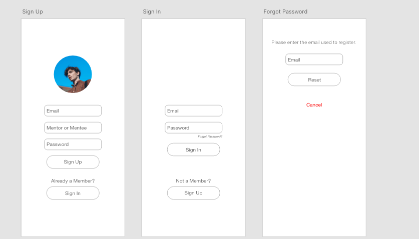
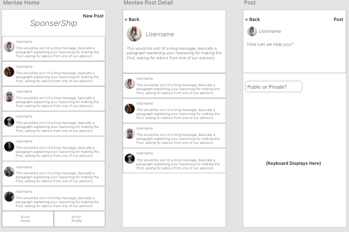
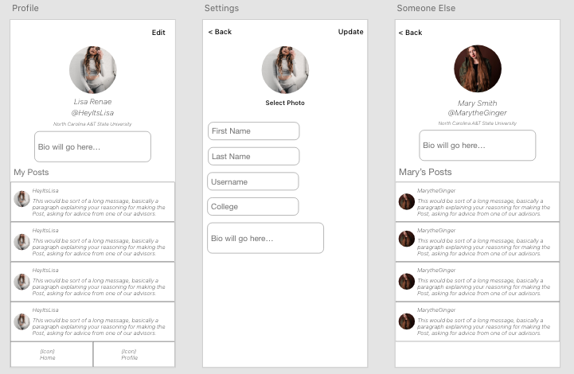
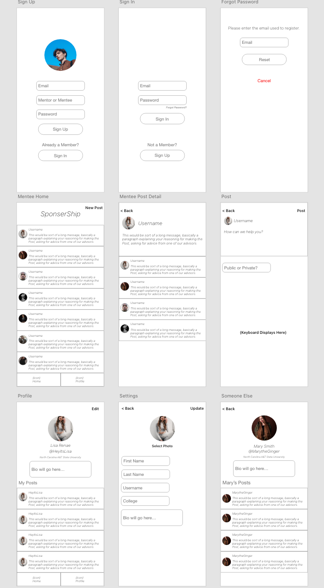

# RehApp

## Table of Contents
1. [Overview](#Overview)
1. [Product Spec](#Product-Spec)
1. [Wireframes](#Wireframes)
2. [Schema](#Schema)

## Overview
### Description
RehApp (pronounced like Rehab) is an application where students may voice their problems and concerns about their mental well-being. Here, doctors and experts trained to identify and help people with mental illnesses can help students with their problems, provide advice, and potentially find a solution or a healthy option for the student. The users will be able to vent or voice their concerns by creating either a private or public post. The public feed can be seen by anyone with an account, while the private feed can only be seen by the creator and trained professionals. There will be categories to which the user can label their posts under. Users are free to comment under different posts. This application is geared towards students struggling with their mental health.

### App Evaluation
- **Category:** Mental wellness
- **Mobile:** This app would be primarily developed for mobile but would perhaps be just as viable on a computer, such as Reddit or other similar apps. Functionality wouldn't be limited to mobile devices, however mobile versions could potentially have more features.
- **Story:** This application would allow users to post about mental issues that they are dealing with, and allow trained professionals to comment and provide advice and potential solutions for them. The user can also message other users and comment on public posts.
- **Market:** This application is geared towards High School and College students. If the user is under 18, their age will be displayed on their profile.
- **Habit:** This app could be used as often as the user wanted depending on how much they would like to seek help, and how much they would like to interact with their friends on the application or view posts that they could potentially relate to and provide their own advice.
- **Scope:** First, we would start with just allowing any student to create an account, and this could potentially evolve into being implemented at different schools and universities.

## Product Spec

### 1. User Stories (Required and Optional)

**Required Must-have Stories**

- [ ] Users can create private and public posts
- [ ] Users can comments on other posts that they are able to view
- [x] Provide a way for the user to edit their profile
- [x] Profile pages for each user
- [x] User can sign up and logs in to view posts, access previous posts, and view profile info.
- [ ] Able to store their posts and information as well as being able to access it

**Optional Nice-to-have Stories**

- [ ] Have different university tabs
    * If a group of people go to a specific university, they can see the posts made by those who go to the same university
- [ ] Allow it to be more customizable

### 2. Screen Archetypes

* **Authentication**
   * **Login information**
       * Upon Download/Reopening of the application, the user is prompted to log in to gain access to their profile information to be properly matched with another person. 
   * **Registration**
       * Register/Create an account if user doesn't have one
* **Streaming**
    * **Private Tab**
        * Can scroll through a list of posts that are made for a select few to see(Professional experts, post author, friends)
        * Can also create a private post
    * **Public tab**
        * Can scroll through a list of posts that are made for the public to see
       * Can also create a public post in where the user allows everyone to see
* **Profile tab**
    * View other users' profiles
    * If on personal profile, they can edit user information (upload a profile picture for example) and click on profile info, where it will get access to settings or their personal info
    * See list of past posts
* **Detail**
    * User can click on a post and view it more in depth
* **Chat Screen**
    * Can message their friends
* **Notifications**
    * Get notified whenever a user gets a response back on their posts or if someone mentions them in a comment section
* **Settings**
    * Can configure settings within the Profile info page

### 3. Navigation

**Tab Navigation** (Tab to Screen)

* Public Feed
* Profile
* Notifications

**Flow Navigation** (Screen to Screen)

* Login
   ->Registration(If no account)
   -> Public feed(If login was successful)
* Public Feed
   -> Create Public post(Creation)
   -> Detailed post(Upon Clicking a post)
* Private Post
    -> Create Private post(Creation)
    -> Detailed post(Upon Clicking a post)
* Profile
    -> View other users' profiles
    -> Edit Information (if on personal profile)
    -> View profile info (if on personal profile)
* Profile Info
    -> Add and edit information for profile
    -> View settings
* Notifications
    -> View post after clicking a specific notification

## Wireframes

 <br>


### [BONUS] Digital Wireframes & Mockups


<br>

<br>

<br>

<br>

### [BONUS] Interactive Prototype

## Schema 
### Models
#### Post

   | Property      | Type     | Description |
   | ------------- | -------- | ------------|
   | objectID      | String   | unique id for the user post |
   | author        | Pointer to User| Post author |
   | urgencyRating | Number     | The rating of how urgent the post is |
   | text       | String   | Post created by author |
   | comments | Pointer to Comment   | Comments posted under a post |
   | category   | String   | The category of the post |
   | commentsCount     | Number | Number of comments under a post |
   | timestamp     | DateTime | Date when post is created |
   
   #### User

   | Property      | Type     | Description |
   | ------------- | -------- | ------------|
   | username      | String   | Unique id for the user |
   | firstName        | String | First name of user |
   | lastName         | String     | Last name of user |
   | image       | File   | Profile picture |
   | email | String   | Email of user |
   | password    | String   | Password of user |
   | college     | String | College/University of user |
   | birthday     | String | Birthday of user |
   
   #### Comment

   | Property      | Type     | Description |
   | ------------- | -------- | ------------|
   | objectID      | String   | Unique id for the user’s comment |
   | message        | String | The text of comment |
   | timestamp         | DateTime     | Date when user posted the comment |
   | author       | String   | Author of the comment |
   | postID | String   | The id of the post that the user commented on |
   
### Networking

#### List of network requests by screen
- Login Screen
    - (Read/Get) Retrieve existing user
    ```
    if(ParseUser.getCurrentUser() != null){
            goMainActivity();
    }
    private void loginUser(String un, String pw){
        ParseUser.logInInBackground(un, pw, new LogInCallback() {
            @Override
            public void done(ParseUser user, ParseException e) {
                if(e!=null){
                    //error handling
                }
                goMainActivity();
            }
     });
    }
    ```
- Registration Screen
    - (Get/Read)Query all posts by author
    ```
    protected void queryPosts() {
        ParseQuery<Post> query = ParseQuery.getQuery(Post.class);
        query.include(Post.KEY_USER);
        query.addDescendingOrder(Post.CREATED_KEY);
        query.findInBackground(new FindCallback<Post>() {
            @Override
            public void done(List<Post> posts, ParseException e) {
                if(e!=null){
                   //error handling
                }
                //saved successfully
        //save all posts
                allPosts.addAll(posts);
                adapter.notifyDataSetChanged();
            }
        });
    }
    ```
    - (Post/Create)Create a new comment on the post
    ```
    let newComment = new Comment();
    newComment.setMessage(msg);
    newComment.setAuthor(userFirstName + userLastName);
    newComment.saveInBackground(new SaveCallBack(){
    @Override
        public void done(ParseException e) {
        if(e!=null){
            //error handling
        }
        //saved successfully
        //more additional code
    }
    });
    ```
    - (Delete)Delete Existing comment
- Create Post Screen
    - (Create/Post)Create a new post object
    ```
    private void savePost(String description, ParseUser currentUser, File photoFile) {
        Post post = new Post();
        post.setKeyDescription(description);
        post.setImage(new ParseFile(photoFile));
        post.setUser(currentUser);
        post.saveInBackground(new SaveCallback() {
            @Override
            public void done(ParseException e) {
                if(e != null){
                    Log.e(TAG, "Error while saving", e);
                    Toast.makeText(getContext(), "Error while saving", Toast.LENGTH_SHORT).show();
                }
                Log.i(TAG, "Saved successfully");
                Toast.makeText(getContext(), "Saved successfully", Toast.LENGTH_SHORT).show();
                descripton.setText("");
                img.setImageResource(0);
            }
        });
    }
    ```
- Detailed Post Screen
    - (Read/Get)Retrieve existing post details
    ```
    let newDetailedPost = new Post();
    newDetailedPost.include(Post.AUTHOR);
    newDetailedPost.include(Post.URGENCY);
    newDetailedPost.include(Post.TEXT);
    newDetailedPost.include(Post.CATEGORY);
    newDetailedPost.include(Post.COMMENTS);
    newDetailedPost.include(Post.COMMENTSCOUNT);
    newDetailedPost.include(Post.CREATE_KEY);
    
    newDetailedPost.findInBackground(new FindCallback(Post){
    //error handling

    //success
    });
    ```
- Personal Profile Screen
    - (Read/Get)Get the current users profile screen
    ```
    let profile = new User();
    profile.include(currentUser);
    profile.include(currentUser.FIRSTNAME);
    profile.include(currentUser.LASTNAME);
    profile.include(currentUser.IMAGE);
    profile.include(currentUser.COLLEGE);
    profile.include(currentUser.BIOGRAPHY);
    
    profile.findINBackground(new FindCallback(){
        //error handling
        //on success
    });
    ```
    - (Read/Get)Get the current users post history
    ```
    profile.include(currentUser.POSTS);
    //iterate through all posts
    //display all posts
    ```
- Other User’s Profile Screen
    - (Read/Get)Get the selected users profile screen
    ```
    let profile = new User();
    profile.include(user.USERNAME);
    profile.include(user.FIRSTNAME);
    profile.include(user.LASTNAME);
    profile.include(user.IMAGE);
    profile.include(user.COLLEGE);
    profile.include(user.BIOGRAPHY);
    
    profile.findINBackground(new FindCallback(){
        //error handling
        //on success
    });
    ```
    - (Read/Get)Get the selected users public post history
    ```
    profile.include(User.POSTS);
    //iterate through all posts
    //display all posts
    ```
- Settings Screen
    - (Update/PUT)Update existing users information

## Progress (Shown in GIFs)
- Worked on UI
 <br>

- Worked on functionality behind UI
 <br>
